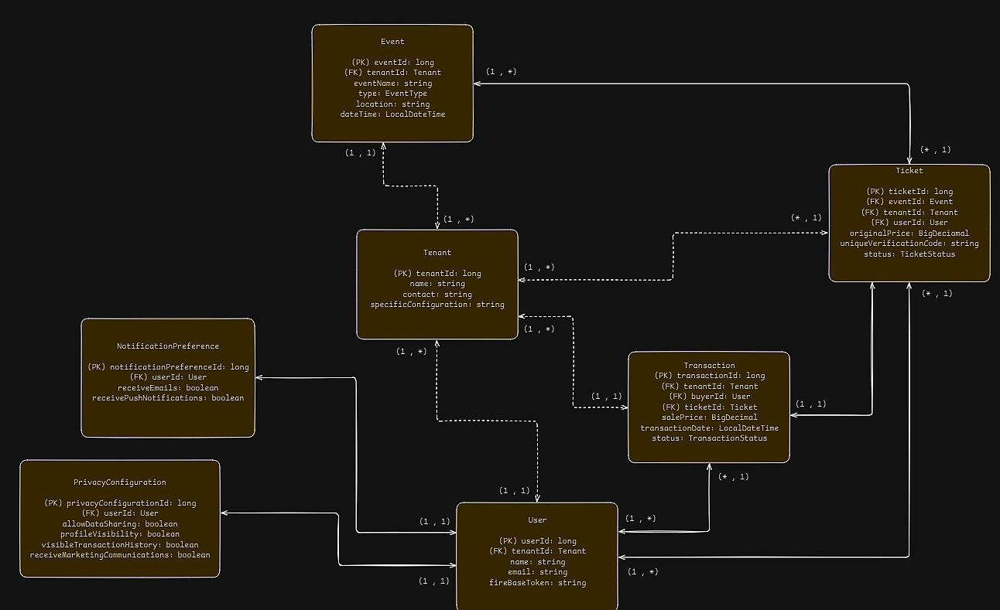

# Trabalho T1 - Construção de Software

## Alunos do Grupo H

- Marcello Marcon
- Otávio Cunha
- Rodrigo Lopes
- Thiago Goulart
  
Linguagem e Framework: Java/Spring

## Data model

## Rodando a aplicação:

1. Clonar o repositório: git clone <https://github.com/ThiagoGoulart02/csw01-grupoh-spring-java.git>
2. Entrar na pasta do projeto: cd csw01-grupoh-spring-java
3. Entrar na pasta do docker: cd docker
4. Rodar o docker (necessário ter o docker instalado): docker compose up
5. Abrir a aplicação em algum editor e rodar ela

6. 
